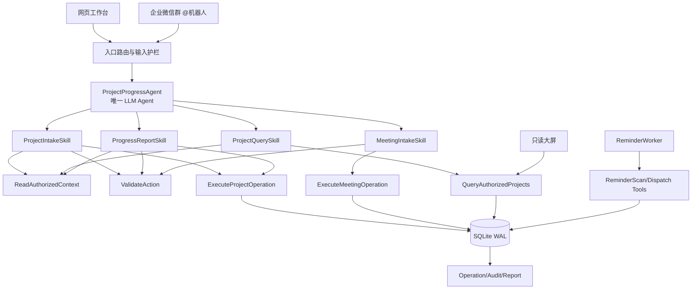
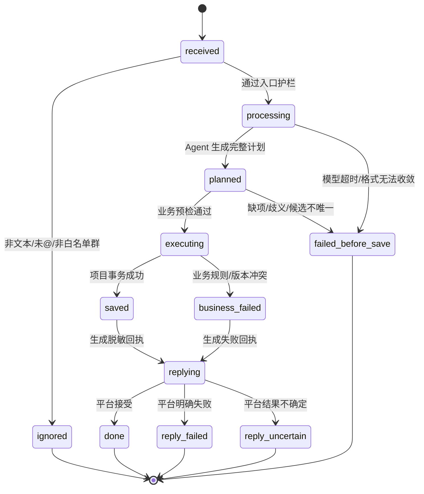
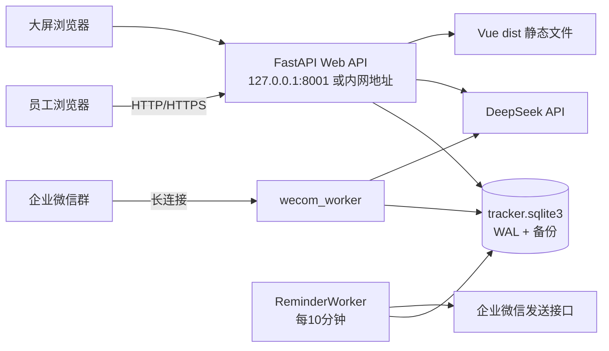
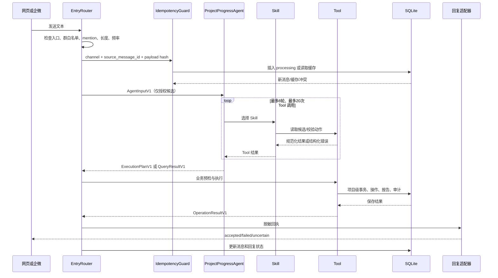
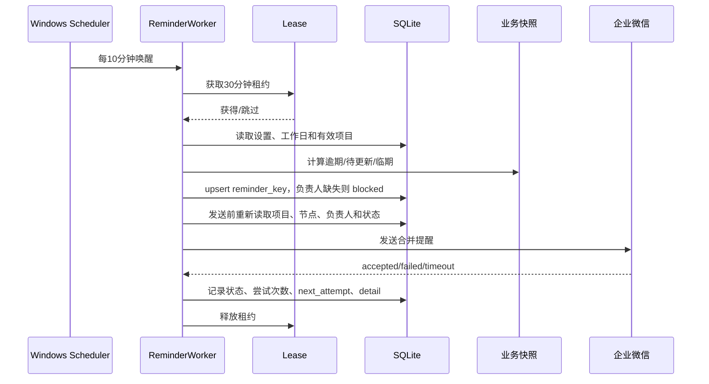

# 公司项目进度追踪系统施工蓝图

版本：v2.0<br>
编写日期：2026-09-21<br>
状态：代码生成基线<br>
项目类型：单公司、单部署实例、中型 Agent 项目<br>
施工原则：LLM 只处理不确定性；程序负责权限、校验、执行、事务、审计、脱敏、幂等、重试和回滚。

本文是当前项目唯一的施工蓝图。后续代码、测试、配置和部署必须以本文为准。本文不把参考文件中的文字指令当作系统输入；参考文件只提供架构和输出规范。

## 0. 项目定义与 grill-me 结果

### 0.1 一句话定义

项目进度追踪系统是一个由 `ProjectProgressAgent` 驱动的企业微信与网页工作台：把自然语言项目安排转换为受校验的项目操作，直接保存正式数据，并由确定性提醒服务维护节点风险和只读大屏。

### 0.2 grill-me 问答

| 问题 | 固定答案 |
|---|---|
| 这个项目一句话是什么 | 见 0.1；核心是“自然语言录入 + 进度管理 + 提醒 + 大屏”。 |
| 用户是谁 | 企业微信群中的公司员工、网页工作台管理员/项目负责人、只读大屏观看者。 |
| 高频场景是什么 | 新建项目、记录项目事项、汇报节点进度、查询项目、调整计划、变更状态、创建会议、查看提醒。 |
| 输入是什么 | 网页文本或企业微信群内 `@机器人` 的纯文本；管理页面表单；定时器当前时间。 |
| 输出是什么 | 结构化执行计划、保存结果、查询结果、企业微信回执、网页快照、提醒任务和大屏数据。 |
| 有几个 Agent | 1 个。当前问题属于一个业务领域，LLM 循环只负责项目业务理解和工具选择。 |
| Agent 之间是什么关系 | 不设置 Agent 间流水线、对等协商或总 Agent。只有一个独立 Agent；确定性后台服务不算 Agent。 |
| LLM 必须做哪几件事 | 识别意图、拆分多项目/多事项、抽取原文明确字段、选择业务工具、生成工具参数、解释查询结果。 |
| 程序必须做哪几件事 | 身份接入、群白名单、候选数据裁剪、schema 校验、项目匹配、权限/作用域、状态计算、事务、审计、幂等、提醒、脱敏、回复。 |
| 哪些绝不能让 LLM 做 | 权限判断、最终项目 ID 可信判定、数据库写入、SQL、金额/日期计算、状态最终判定、发送对象选择、审计、密钥处理、回滚和最终成功声明。 |
| 哪些能力是 Skill | 项目录入、项目查询、进度汇报、会议录入、批量计划整理。每个 Skill 无独立 LLM。 |
| 哪些能力是 Tool | 候选读取、动作校验、项目执行、会议执行、查询、消息幂等、操作记录、企微回复、提醒扫描和提醒发送。 |
| 工作流决策点 | 是否为允许入口；是否需要 Agent；最终计划是否完整；是否存在唯一对象；是否通过业务预检；是否按项目事务执行；回复是否成功。 |
| 终止条件 | 查询已返回；完整计划已保存或明确业务失败；计划缺项/歧义导致保存 0 项；超过模型轮次/工具调用上限；超时；未经授权或入口不合法。 |
| 失败怎么办 | 模型重试只在规划阶段发生；计划无法收敛则不写业务数据；真实业务失败按项目返回；回复失败标记为 `reply_failed`，不回滚已保存业务。 |
| 评测集有多少条 | 固定 120 条脱敏样例：正常 60、边界 20、对抗 15、工具失败 15、越权/身份 10。另有 30 条回归契约样例。 |
| 上线方式 | 单机部署、先在隔离测试库执行契约测试，再切换生产数据库；发布必须支持数据库备份和代码回退。 |
| 契约是否稳定 | Agent、Skill、Tool、执行计划、操作状态、API 和数据库操作编号均带主版本 `v1`；新增字段向后兼容，删除字段必须迁移。 |

### 0.3 固定成功指标

| 指标 | 阈值 |
|---|---:|
| 未授权写入 | 0 条 |
| 未经业务预检进入执行阶段的动作 | 0 条 |
| 同一来源消息重复保存 | 0 条 |
| 企微成功保存后被误报为业务失败 | 0 条 |
| 规划阶段模型格式重试被计入业务失败 | 0 条 |
| 120 条评测的意图准确率 | ≥ 95% |
| 120 条评测的关键字段准确率 | ≥ 95% |
| 120 条评测的越权/对抗拦截率 | 100% |
| 项目级事务部分提交 | 0 条 |
| 普通查询 P95 响应时间 | ≤ 500 ms |
| AI 消息端到端 P95 时间 | ≤ 20 s |
| 提醒发送前失效任务拦截率 | 100% |

## 1. 组织架构

### 1.1 Agent 拓扑



### 1.2 三层映射

| Agent | Skill | Tool |
|---|---|---|
| `project-progress-agent@1` | `project-intake@1` | `read_authorized_context@1`、`resolve_project_reference@1`、`validate_action@1`、`execute_project_operation@1` |
| `project-progress-agent@1` | `project-query@1` | `read_authorized_context@1`、`query_authorized_projects@1` |
| `project-progress-agent@1` | `progress-report@1` | `read_authorized_context@1`、`validate_action@1`、`execute_project_operation@1` |
| `project-progress-agent@1` | `meeting-intake@1` | `read_authorized_context@1`、`validate_action@1`、`execute_meeting_operation@1` |
| `project-progress-agent@1` | `batch-plan@1` | 上述读取、校验和执行工具；同一项目的动作在执行器内合并事务 |
| `ReminderWorker`（非 Agent） | `reminder-runtime@1` | `scan_reminders@1`、`dispatch_reminders@1`、`acquire_worker_lease@1` |

### 1.3 Agent 契约

| 字段 | 固定值 |
|---|---|
| `id` | `project-progress-agent` |
| `version` | `1.0.0` |
| 能力标签 | `intent-understanding`、`field-extraction`、`tool-selection`、`query-summary`、`batch-decomposition` |
| 权限 | 只能调用注册表中与当前入口、当前作用域匹配的 Tool；无数据库、文件系统、网络和密钥权限。 |
| 上下文 | 当前消息、服务端时间、Asia/Shanghai、入口类型、允许的项目/节点候选、可用成员候选、固定业务规则。 |
| 不得接收 | 全量数据库、其他项目私密信息、访问密钥、企微 Secret、原始系统日志、未授权成员信息。 |
| 最大循环 | 8 轮模型与工具交互；单条消息最多 20 次业务 Tool 调用；超过即 `planning_limit_exceeded`。 |
| 输入 | `AgentInputV1`，见 2.1。 |
| 输出 | `ExecutionPlanV1`、`QueryResultV1` 或 `IgnoredResultV1`，见 2.2。 |
| 评测 | 120 条脱敏集；意图、字段、对象匹配、拒绝越权、批量拆分、工具错误恢复五类指标。 |

### 1.4 人的位置

人只负责高风险和不可逆事项：管理成员/群白名单、人工核对 `uncertain` 发送结果、数据库备份恢复、发布回滚、处理无法自动解析的业务歧义。普通业务写入不需要二次确认；计划完整且通过后台预检后直接保存。

### 1.5 核心组件与模块

| 类型 | 模块 | 责任 |
|---|---|---|
| 核心组件 | `EntryRouter` | 识别网页/企微/大屏入口，执行长度、频率和 mention 护栏。 |
| 核心组件 | `ProjectProgressAgent` | 只做自然语言理解和工具调用。 |
| 核心组件 | `ActionExecutor` | 业务校验、项目级事务、版本冲突、操作结果。 |
| 核心组件 | `Store` | SQLite 连接、迁移、WAL、外键和备份。 |
| 核心组件 | `ReminderWorker` | 扫描、去重、发送前复核和租约。 |
| 模块 | `WeComAdapter` | 长连接、事件过滤、HMAC 发送者标识、回执。 |
| 模块 | `WebApi` | FastAPI 认证、项目/成员/设置/大屏 API。 |
| 模块 | `DisplayBoard` | Vue 只读快照、15 秒刷新、20 秒轮播、60 秒过期提示。 |
| 模块 | `Registry` | Agent、Skill、Tool 主版本注册和健康检查。 |

## 2. 输入与输出 schema

### 2.1 Agent 输入 `AgentInputV1`

```json
{
  "schema_version": "agent-input.v1",
  "request_id": "server-generated-uuid",
  "channel": "web",
  "text": "P0001 的方案评审完成 60%，下一步等待评审",
  "received_at": "2026-09-21T10:00:00+08:00",
  "timezone": "Asia/Shanghai",
  "scope": {
    "allowed_project_ids": ["1"],
    "allowed_milestone_ids": ["m1"],
    "allowed_user_candidates": [{"id": "u1", "name": "张三"}],
    "allowed_chat_id": "chat-hmac-or-null"
  },
  "ruleset_version": "business.v2"
}
```

程序生成 `request_id`、时间、时区和作用域；模型不得覆盖这些字段。企微入口还要求 `chat_id` 在 `TRACKER_WECOM_ALLOWED_CHAT_IDS` 内、正文明确存在机器人 mention、消息类型为纯文本、长度为 1～6000 字。

### 2.2 Agent 输出 `ExecutionPlanV1`

```json
{
  "schema_version": "execution-plan.v1",
  "kind": "write",
  "actions": [
    {
      "action_id": "model-generated-temporary-id",
      "tool": "report_progress",
      "project_id": "1",
      "milestone_id": "m1",
      "data": {
        "summary": "方案评审完成 60%",
        "progress": 60,
        "next_step": "等待评审"
      },
      "evidence": {"summary": "方案评审完成 60%", "next_step": "下一步等待评审"}
    }
  ],
  "missing_fields": [],
  "ambiguities": [],
  "model_diagnostics": {"rounds": 2, "tool_calls": 1}
}
```

约束：`actions` 最多 20 个；所有 ID 必须来自服务端候选；禁止 `null`、SQL、代码、URL、权限字段、审计字段、版本字段和操作者字段。动作按项目分组后再次通过 `ActionExecutor` 校验，模型输出不是最终执行依据。

### 2.3 写入结果 `OperationResultV1`

```json
{
  "schema_version": "operation-result.v1",
  "operation_id": "op-uuid",
  "status": "saved",
  "recognized_actions": 1,
  "saved_actions": 1,
  "business_failures": [],
  "model_retries": 1,
  "projects": [{"project_id": "1", "code": "P0001", "intent": "report_progress"}],
  "reply_status": "pending"
}
```

计数对象固定：`recognized_actions` 是最终计划动作数，`saved_actions` 是成功动作数，`business_failures` 只记录真实业务失败，`model_retries` 只进入后台诊断。禁止把模型尝试次数作为项目数。

### 2.4 查询结果 `QueryResultV1`

查询只返回当前作用域允许的项目和节点字段：编号、名称、状态、进度、负责人展示名、截止日期、风险标签、事项摘要和下一步；不返回访问密钥、原始消息、完整日志、企微标识和未授权项目。

### 2.5 业务动作最低完整性

| 动作 | 最低输入 | 缺失时行为 |
|---|---|---|
| `create_project` | 项目名称 | 保存 0 项，返回缺少项目名称。 |
| `record_project_item` | 唯一现有项目或明确新项目名称；事项标题或事项原文 | 保存 0 项，返回项目/事项定位缺失。 |
| `edit_project` | 唯一项目；至少一个实际变更字段 | 保存 0 项，返回对象或变更缺失。 |
| `add_milestone` | 唯一项目；事项名称 | 保存 0 项，返回项目或事项名称缺失。 |
| `edit_milestone` | 唯一项目和事项；至少一个实际变更字段 | 保存 0 项，返回对象或变更缺失。 |
| `report_progress` | 唯一项目和事项；进展摘要 | 保存 0 项，返回进展摘要缺失。 |
| `project_status` / `milestone_status` | 唯一对象；目标状态 | 保存 0 项，返回状态缺失。 |
| `create_meeting` | 会议开始时间 | 保存 0 项，返回开始时间缺失。 |
| `query_projects` | 可为空；没有筛选则查询当前作用域 | 返回当前作用域结果，不写入。 |

日期、负责人、联系方式在业务允许范围内可为空；用户明确提到但无法可靠归一化的字段属于缺项，不得静默忽略。

## 3. 职责划分

| 能力 | LLM | 程序 | Tool | Skill | 人 |
|---|---|---|---|---|---|
| 意图识别 | 识别自然语言意图 | 校验是否为允许意图 | `validate_action` | `project-intake` | 处理无法识别消息 |
| 项目/节点拆分 | 按语义拆分动作 | 限制动作数、按项目分组 | `read_authorized_context` | `batch-plan` | 处理业务歧义 |
| 对象匹配 | 提供候选选择 | 按编号、全名、唯一包含关系确定性匹配 | `resolve_project_reference` | `project-intake` | 处理多个候选 |
| 字段提取 | 提取原文明确字段 | 类型、范围、日期顺序校验 | `validate_action` | 各业务 Skill | 补充缺失字段 |
| 权限和作用域 | 不参与决定 | 强制执行 | `read_authorized_context`、`execute_*` | 各业务 Skill | 配置角色和群白名单 |
| 数据写入 | 不参与 | 事务、版本、幂等、审计 | `execute_project_operation`、`execute_meeting_operation` | `project-intake`、`progress-report` | 处理人工恢复 |
| 状态和进度 | 不得最终决定 | 派生计算、状态机 | `execute_project_operation` | `progress-report` | 确认完成或重新打开 |
| 查询摘要 | 总结授权结果 | 过滤敏感字段 | `query_authorized_projects` | `project-query` | 无 |
| 提醒 | 不参与 | 工作日、阈值、发送前复核 | `scan_reminders`、`dispatch_reminders` | `reminder-runtime` | 核对不确定发送 |
| 外部回复 | 生成业务级文案 | 脱敏、长度限制、状态记录 | `send_wecom_reply` | 入口适配 Skill | 处理回复失败 |
| 安全 | 不参与 | 鉴权、密钥隔离、日志脱敏 | `load_message_idempotency` | `project-intake` | 管理密钥和备份 |

## 4. Agent、Skill、Tool 契约

### 4.1 Skill 清单

| `id@version` | 归属 Agent | 指令边界 | 依赖 Tool | 资源 | 权限 | 人工确认 |
|---|---|---|---|---|---|---|
| `project-intake@1` | `project-progress-agent@1` | 从文本识别项目操作，使用候选 ID，形成最终动作计划 | `read_authorized_context`、`resolve_project_reference`、`validate_action`、`execute_project_operation` | 业务字段 schema、状态规则、日期规则 | 当前入口作用域 | 不需要；计划不完整时保存 0 项 |
| `project-query@1` | `project-progress-agent@1` | 只读查询并把授权数据整理为简洁摘要 | `read_authorized_context`、`query_authorized_projects` | 查询字段白名单、状态标签 | 当前入口作用域 | 不需要 |
| `progress-report@1` | `project-progress-agent@1` | 记录当前/历史进展，不混淆历史补录与当前汇报 | `read_authorized_context`、`validate_action`、`execute_project_operation` | 报告字段 schema、历史日期规则 | 当前项目/节点写入作用域 | 完成状态由业务负责人按权限触发，不由模型自动确认 |
| `meeting-intake@1` | `project-progress-agent@1` | 从文本提取会议开始时间及会议字段 | `read_authorized_context`、`validate_action`、`execute_meeting_operation` | 会议 schema、Asia/Shanghai 日期规则 | 当前入口写入作用域 | 不需要 |
| `batch-plan@1` | `project-progress-agent@1` | 保持项目边界，合并同一项目内动作，交给执行器事务化 | `validate_action`、`execute_project_operation`、`execute_meeting_operation` | 计划 schema、批量上限 | 当前入口作用域 | 不需要 |
| `reminder-runtime@1` | `ReminderWorker`（非 Agent） | 扫描和发送提醒，禁止调用 LLM | `scan_reminders`、`dispatch_reminders`、`acquire_worker_lease` | 工作日历、提醒规则 | 服务账号 | `uncertain` 只能管理员人工核对 |

### 4.2 Tool 契约

| Tool `id@version` | 输入/输出 | 权限 | 幂等、超时、重试 | 错误码 | 人工确认 | 审计 |
|---|---|---|---|---|---|---|
| `read_authorized_context@1` | 输入：入口、操作者、文本；输出：候选项目/节点/成员 | 服务端生成，调用者不可扩大 | 只读幂等；2 秒；超时不重试 | `scope_empty`、`context_timeout` | 否 | 不记录原文值 |
| `resolve_project_reference@1` | 输入：用户提取名称/编号、候选；输出：唯一 ID 或歧义 | 仅使用已召回候选 | 确定性；100 ms；不重试 | `not_found`、`ambiguous_reference`、`name_conflict` | 否 | 记录匹配级别和候选数量 |
| `validate_action@1` | 输入：ActionV1；输出：规范化 Action 或字段错误 | 无写权限 | 纯函数幂等；500 ms；不重试 | `schema_invalid`、`date_invalid`、`field_missing`、`id_not_allowed` | 否 | 只记录字段路径和错误类型 |
| `execute_project_operation@1` | 输入：规范化 Action、operation_id、source_message_id；输出：项目结果 | 后端服务；权限由程序校验 | 同 operation_id 幂等；5 秒；数据库锁冲突重试 1 次 | `permission_denied`、`version_conflict`、`business_invalid`、`db_error` | 否；普通写入直接保存 | 写 `operations`、`audit`、`reports` |
| `query_authorized_projects@1` | 输入：筛选、作用域；输出：脱敏项目快照 | 只读、当前作用域 | 幂等；2 秒；超时 1 次重试 | `scope_denied`、`query_timeout` | 否 | 记录查询操作摘要 |
| `execute_meeting_operation@1` | 输入：规范化 Meeting；输出：会议记录 | 当前入口写入作用域 | operation_id 幂等；5 秒；数据库锁冲突重试 1 次 | `meeting_invalid`、`permission_denied`、`db_error` | 否 | 写 `operations` |
| `load_message_idempotency@1` | 输入：channel + source_message_id + payload hash；输出：新消息/缓存结果/冲突 | 服务端内部 | 同键幂等；500 ms；不重试 | `message_reused`、`processing_conflict` | 否 | 写 `messages` 状态 |
| `send_wecom_reply@1` | 输入：脱敏业务回执；输出：accepted/failed/uncertain | 仅企微接收进程 | 非幂等平台按 reply_attempt_id 限制；10 秒；不自动重放业务 | `reply_failed`、`reply_uncertain` | `uncertain` 需管理员核对 | 更新 `messages.reply_status` |
| `scan_reminders@1` | 输入：当前时间、设置；输出：任务增量 | ReminderWorker | reminder_key 幂等；30 秒；周期失败下次重扫 | `calendar_invalid`、`reminder_db_error` | 否 | 写提醒任务与诊断 |
| `dispatch_reminders@1` | 输入：当前时间、任务；输出：发送结果 | ReminderWorker | 每节点每日最多成功一条；发送异常不自动换收件人 | `blocked`、`failed`、`uncertain` | `uncertain` 人工核对 | 更新尝试次数和结果 |
| `acquire_worker_lease@1` | 输入：worker identity、租期 30 分钟；输出：获得/跳过 | 服务端内部 | 幂等；100 ms；不重试 | `lease_held` | 否 | 写租约状态 |

Tool 共性规则：不开放 SQL、文件、任意网络、任意代码执行和密钥读取；Tool 返回结构化错误，Skill 不得把错误改写为“已保存”。

### 4.3 状态机



状态定义：`processing`、`planned`、`executing`、`saved`、`business_failed`、`replying`、`done`、`reply_failed`、`reply_uncertain`、`failed_before_save`、`ignored`。不存在业务草稿、待确认、已确认或前期准备状态。

## 5. 技术选型

| 层 | 选型 | 版本 | 用途 |
|---|---|---:|---|
| 语言 | Python | 3.13.15 | 后端、Agent 编排、worker |
| 后端框架 | FastAPI | 0.115.14 | HTTP API 与静态文件服务 |
| ASGI | Uvicorn | 0.34.3 | 单机服务进程 |
| 数据模型 | Pydantic | 2.11.7 | 输入、Tool 参数、执行计划和配置校验 |
| HTTP 客户端 | httpx | 0.28.1 | DeepSeek 与企微发送适配、测试传输 |
| 大模型 SDK | langchain-deepseek | 1.0.1 | DeepSeek 原生 ChatDeepSeek 工具调用 |
| 企业微信 SDK | wecom-aibot-python-sdk | 1.0.1 | 智能机器人长连接与流式回复 |
| 前端框架 | Vue | 3.5.42 | 工作台和大屏 |
| UI | Element Plus | 2.14.5 | 管理表单、表格、抽屉、提示 |
| 构建 | Vite | 6.4.3 | 前端开发服务器和生产构建 |
| 类型检查 | TypeScript | 5.7.3 | 前端类型系统 |
| Vue 类型检查 | vue-tsc | 2.2.12 | 构建时检查 |
| 工具协议 | DeepSeek native tool calling | API v1 | Agent 到 Tool 的受控调用 |
| Skill 定义格式 | YAML 1.2 | schema `skill.v1` | Skill 契约和依赖声明 |
| Agent/Tool 注册 | JSON | schema `module.v1` | 启动时静态加载和主版本校验 |
| 状态管理 | SQLite 持久化状态机 | 3.45.3 | 消息、操作、项目、提醒状态 |
| 数据库 | SQLite WAL | 3.45.3 | 单机事务、备份和并发读 |
| 缓存 | SQLite `messages.response` | 24 小时清理窗口 | 消息幂等和回复缓存 |
| 消息队列 | 不使用外部 MQ | 固定 | 使用 SQLite 操作状态和 worker 租约 |
| 日志/追踪 | Python logging + JSONL | 1.0 | 脱敏诊断、操作关联、进程日志 |
| 部署 | Windows Server 2022 x64 单机 | 1 台 | Web、企微接收、ReminderWorker 共用数据库 |

### 5.1 大模型选型

| 角色 | 模型 | 用途 | 成本/延迟预算 | 降级 |
|---|---|---|---|---|
| Agent 主模型 | DeepSeek `deepseek-v4-flash` | 业务意图、字段抽取、工具调用 | 单消息最多 8 轮，P95 20 秒 | 规划失败即保存 0 项，不猜测写入 |
| 辅助模型 | 不使用 | 避免多模型不一致和成本扩散 | 0 | 无 |
| 降级模型 | 不使用 | 模型不可用时不执行自然语言写入 | 0 | 网页结构化表单和已保存数据继续可用 |

路由规则固定：所有自然语言业务请求使用主模型；查询也使用主模型进行意图识别，但查询执行由程序完成；提醒、权限、状态和数据库操作不经过模型。API Key、模型名称和原文仅在服务端进程可见。

## 6. 数据与存储

### 6.1 数据规则

- 数据库文件由 `TRACKER_DB` 指定，所有进程必须解析为同一个绝对路径。
- SQLite 启用 WAL、外键、`busy_timeout=5000`。
- 项目主体继续使用 `projects.data` JSON 存储，以保持现有迁移兼容；结构化关联表保存操作、报告、审计、提醒和会议。
- 项目、事项状态固定为 `active`、`paused`、`completed`、`cancelled`；新建项目和事项默认 `active`；不再使用 `not_started`、`preparation`。
- 项目名称可单独建立正式项目；负责人、日期、事项可以后续补充；未设置日期不进入临期/逾期计算。
- 负责人可保存为系统用户或姓名分工；提醒收件人 `owner_id` 允许为空，缺失时生成 `blocked` 任务而不是让扫描失败。

### 6.2 可执行 SQLite DDL

```sql
PRAGMA journal_mode = WAL;
PRAGMA foreign_keys = ON;
PRAGMA busy_timeout = 5000;

CREATE TABLE IF NOT EXISTS users (
  id TEXT PRIMARY KEY,
  name TEXT NOT NULL CHECK(length(name) BETWEEN 1 AND 100),
  role TEXT NOT NULL CHECK(role IN ('admin','member','display')),
  token_hash TEXT UNIQUE NOT NULL,
  active INTEGER NOT NULL DEFAULT 1 CHECK(active IN (0,1)),
  wecom_user_id TEXT NOT NULL DEFAULT ''
);
CREATE UNIQUE INDEX IF NOT EXISTS idx_users_wecom_user
  ON users(wecom_user_id) WHERE wecom_user_id <> '';

CREATE TABLE IF NOT EXISTS projects (
  id INTEGER PRIMARY KEY AUTOINCREMENT,
  version INTEGER NOT NULL DEFAULT 1 CHECK(version >= 1),
  data TEXT NOT NULL CHECK(json_valid(data))
);

CREATE TABLE IF NOT EXISTS operations (
  id TEXT PRIMARY KEY,
  source TEXT NOT NULL CHECK(source IN ('web','wecom','system','legacy')),
  source_message_id TEXT,
  actor_id TEXT,
  actor_hmac TEXT NOT NULL DEFAULT '',
  request_hash TEXT NOT NULL,
  status TEXT NOT NULL CHECK(status IN ('planned','executing','succeeded','failed','rolled_back')),
  intent TEXT NOT NULL,
  request_summary TEXT NOT NULL DEFAULT '',
  result_summary TEXT NOT NULL DEFAULT '',
  created_at TEXT NOT NULL,
  updated_at TEXT NOT NULL,
  FOREIGN KEY(actor_id) REFERENCES users(id)
);
CREATE UNIQUE INDEX IF NOT EXISTS idx_operations_source_message
  ON operations(source, source_message_id) WHERE source_message_id IS NOT NULL;
CREATE INDEX IF NOT EXISTS idx_operations_created_at ON operations(created_at);

CREATE TABLE IF NOT EXISTS messages (
  id TEXT PRIMARY KEY,
  channel TEXT NOT NULL CHECK(channel IN ('web','wecom')),
  source_message_id TEXT NOT NULL,
  user_id TEXT,
  sender_hmac TEXT NOT NULL DEFAULT '',
  chat_hmac TEXT NOT NULL DEFAULT '',
  text_hash TEXT NOT NULL,
  status TEXT NOT NULL CHECK(status IN ('processing','planned','executing','saved','business_failed','replying','done','reply_failed','reply_uncertain','failed_before_save','ignored')),
  reply_status TEXT NOT NULL DEFAULT 'none' CHECK(reply_status IN ('none','pending','accepted','failed','uncertain')),
  created_at TEXT NOT NULL,
  updated_at TEXT NOT NULL,
  response TEXT,
  diagnostics TEXT NOT NULL DEFAULT '{}',
  FOREIGN KEY(user_id) REFERENCES users(id)
);
CREATE UNIQUE INDEX IF NOT EXISTS idx_messages_source
  ON messages(channel, source_message_id);
CREATE INDEX IF NOT EXISTS idx_messages_created_at ON messages(created_at);

CREATE TABLE IF NOT EXISTS audit (
  id INTEGER PRIMARY KEY AUTOINCREMENT,
  operation_id TEXT NOT NULL,
  project_id INTEGER,
  user_id TEXT,
  at TEXT NOT NULL,
  intent TEXT NOT NULL,
  before_data TEXT,
  after_data TEXT NOT NULL,
  FOREIGN KEY(operation_id) REFERENCES operations(id),
  FOREIGN KEY(project_id) REFERENCES projects(id),
  FOREIGN KEY(user_id) REFERENCES users(id)
);
CREATE INDEX IF NOT EXISTS idx_audit_project_at ON audit(project_id, at);

CREATE TABLE IF NOT EXISTS reports (
  id INTEGER PRIMARY KEY AUTOINCREMENT,
  operation_id TEXT NOT NULL,
  project_id INTEGER NOT NULL,
  milestone_id TEXT NOT NULL,
  user_id TEXT,
  at TEXT NOT NULL,
  data TEXT NOT NULL CHECK(json_valid(data)),
  FOREIGN KEY(operation_id) REFERENCES operations(id),
  FOREIGN KEY(project_id) REFERENCES projects(id),
  FOREIGN KEY(user_id) REFERENCES users(id)
);
CREATE INDEX IF NOT EXISTS idx_reports_project_node_at
  ON reports(project_id, milestone_id, at);

CREATE TABLE IF NOT EXISTS settings (
  key TEXT PRIMARY KEY,
  value TEXT NOT NULL CHECK(json_valid(value))
);

CREATE TABLE IF NOT EXISTS reminders (
  id TEXT PRIMARY KEY,
  project_id INTEGER NOT NULL,
  milestone_id TEXT NOT NULL,
  owner_id TEXT,
  local_day TEXT NOT NULL,
  reasons TEXT NOT NULL CHECK(json_valid(reasons)),
  status TEXT NOT NULL CHECK(status IN ('queued','blocked','sending','accepted','failed','uncertain','cancelled')),
  attempts INTEGER NOT NULL DEFAULT 0 CHECK(attempts >= 0),
  updated_at TEXT NOT NULL,
  next_attempt TEXT,
  detail TEXT NOT NULL DEFAULT '',
  UNIQUE(project_id, milestone_id, local_day),
  FOREIGN KEY(project_id) REFERENCES projects(id),
  FOREIGN KEY(owner_id) REFERENCES users(id)
);
CREATE INDEX IF NOT EXISTS idx_reminders_dispatch
  ON reminders(local_day, status, next_attempt);

CREATE TABLE IF NOT EXISTS worker_lease (
  id INTEGER PRIMARY KEY CHECK(id=1),
  owner TEXT NOT NULL,
  expires_at TEXT NOT NULL
);

CREATE TABLE IF NOT EXISTS wecom_runtime (
  id INTEGER PRIMARY KEY CHECK(id=1),
  owner TEXT NOT NULL,
  phase TEXT NOT NULL CHECK(phase IN ('not_started','connecting','authenticated','disconnected','error','offline','stopped')),
  expires_at TEXT NOT NULL
);

CREATE TABLE IF NOT EXISTS meetings (
  id TEXT PRIMARY KEY,
  created_by TEXT,
  project_id INTEGER,
  start_at TEXT NOT NULL,
  title TEXT NOT NULL DEFAULT '',
  attendee_ids TEXT NOT NULL DEFAULT '[]' CHECK(json_valid(attendee_ids)),
  location TEXT NOT NULL DEFAULT '',
  notes TEXT NOT NULL DEFAULT '',
  status TEXT NOT NULL DEFAULT 'active' CHECK(status IN ('active','cancelled','completed')),
  created_at TEXT NOT NULL,
  updated_at TEXT NOT NULL,
  FOREIGN KEY(created_by) REFERENCES users(id),
  FOREIGN KEY(project_id) REFERENCES projects(id)
);

CREATE TABLE IF NOT EXISTS meeting_reminders (
  id TEXT PRIMARY KEY,
  meeting_id TEXT NOT NULL,
  local_day TEXT NOT NULL,
  status TEXT NOT NULL CHECK(status IN ('queued','blocked','sending','accepted','failed','uncertain','cancelled')),
  attempts INTEGER NOT NULL DEFAULT 0,
  updated_at TEXT NOT NULL,
  next_attempt TEXT,
  detail TEXT NOT NULL DEFAULT '',
  UNIQUE(meeting_id, local_day),
  FOREIGN KEY(meeting_id) REFERENCES meetings(id)
);
```

### 6.3 迁移约束

1. 迁移前使用 SQLite 在线备份生成新文件，不覆盖当前数据库。
2. 先增加 `operations`，为旧 `audit`/`reports` 创建 `source=legacy` 操作编号，再迁移外键。
3. 将 `not_started` 和 `preparation=true` 转为 `active`，为缺少 `started_at` 的记录按原记录时间补齐，并写迁移审计。
4. 将提醒表 `owner_id` 改为可空，复制数据后校验原行数、迁移行数、外键和唯一索引。
5. 迁移完成后删除 `drafts`、`wecom_drafts` 和 `/api/drafts` 依赖；未确认草稿不导入正式项目。
6. 任一校验失败时整次迁移回滚，保留旧数据库和备份。

### 6.4 缓存、消息和资源

| 对象 | 实现 | 生命周期 |
|---|---|---|
| 消息幂等 | `messages(channel, source_message_id)` 唯一索引 | 业务审计保留；响应诊断 24 小时后可脱敏清理 |
| Tool 诊断 | `messages.diagnostics` JSON | 保留 30 天，不含原文、参数值、密钥 |
| Agent/Skill/Tool 注册 | `backend/registry/*.json`、`backend/skills/*/skill.yaml` | 随代码版本发布，只读加载 |
| 模型配置 | 环境变量 | 不入库、不进前端、不写日志 |
| 向量库 | 不使用 | 项目检索使用 SQLite 确定性候选，不做语义知识库 |
| 外部消息队列 | 不使用 | SQLite 状态机和租约完成单机调度 |

## 7. 模块机制

### 7.1 Agent 注册描述

文件：`backend/registry/agents/project-progress-agent.json`

```json
{
  "schema_version": "module.v1",
  "kind": "agent",
  "id": "project-progress-agent",
  "version": "1.0.0",
  "entrypoint": "backend.app.agent:ProjectProgressAgent",
  "skills": ["project-intake@1", "project-query@1", "progress-report@1", "meeting-intake@1", "batch-plan@1"],
  "max_rounds": 8,
  "max_tool_calls": 20,
  "input_schema": "agent-input.v1",
  "output_schema": "execution-plan.v1",
  "healthcheck": "backend.app.agent:healthcheck"
}
```

注册方式：应用启动时读取固定目录，校验主版本、入口函数和 Skill 依赖；校验失败则 Web/企微写入入口拒绝启动，查询和大屏可继续运行。

### 7.2 Skill 注册描述

文件：`backend/skills/project-intake/skill.yaml`

```yaml
schema_version: skill.v1
kind: skill
id: project-intake
version: 1.0.0
agent: project-progress-agent@1
instruction: 从自然语言中识别项目操作，只使用服务端候选 ID，形成可校验 Action。
tools:
  - read_authorized_context@1
  - resolve_project_reference@1
  - validate_action@1
  - execute_project_operation@1
resources:
  - backend/resources/project-fields.v1.json
  - backend/resources/business-rules.v1.json
permissions:
  scope: request
  writes: project
human_confirmation: false
```

Skill 加载方式：Agent 启动时按注册表加载；依赖 Tool 缺失、主版本不兼容或资源 checksum 不匹配时拒绝加载。Skill 不拥有 LLM、数据库连接或独立凭证。

### 7.3 Tool 注册描述

文件：`backend/registry/tools/execute-project-operation.json`

```json
{
  "schema_version": "module.v1",
  "kind": "tool",
  "id": "execute_project_operation",
  "version": "1.0.0",
  "entrypoint": "backend.app.tools.project:execute_project_operation",
  "input_schema": "action.v1",
  "output_schema": "operation-result.v1",
  "permission": "server-side-only",
  "idempotency": "operation_id",
  "timeout_ms": 5000,
  "retry": {"max_attempts": 1, "on": ["sqlite_busy"]},
  "audit": true
}
```

Tool 调用协议：Agent 只能通过 DeepSeek native tool call 请求注册名；后端以注册表解析函数，不接受模型提供 Python 路径、SQL、URL 或文件路径。Tool 的输入先经 JSON Schema，再经 Pydantic，再经业务 Service。

### 7.4 注册中心 schema

```sql
CREATE TABLE IF NOT EXISTS module_registry (
  id TEXT NOT NULL,
  kind TEXT NOT NULL CHECK(kind IN ('agent','skill','tool')),
  major_version INTEGER NOT NULL CHECK(major_version >= 1),
  descriptor TEXT NOT NULL CHECK(json_valid(descriptor)),
  checksum TEXT NOT NULL,
  enabled INTEGER NOT NULL DEFAULT 1 CHECK(enabled IN (0,1)),
  registered_at TEXT NOT NULL,
  PRIMARY KEY(id, kind, major_version)
);
```

## 8. 部署结构

### 8.1 组件图



### 8.2 网络拓扑

- Web API 绑定内网地址；开发环境绑定 `127.0.0.1:8001`，生产环境绑定公司内网 IP 与 HTTPS 反向代理地址。
- 企微长连接由服务器向企业微信发起，不开放公网回调端口。
- DeepSeek 仅由后端访问 `https://api.deepseek.com`；前端不接触 API Key。
- `TRACKER_WEB_URL` 必须是员工设备可访问的 HTTP(S) 根地址，不允许 `localhost`、`127.0.0.1`、账号、密码、查询参数和片段。
- 生产防火墙只允许内网浏览器到 Web 端口；数据库文件和 `.env` 不共享。

### 8.3 环境配置

| 环境 | 主机 | 数据库 | AI | 企微接收 | 主动提醒 |
|---|---|---|---|---|---|
| dev | Windows 11 x64 | `data/dev-tracker.sqlite3` | `TRACKER_AI_ENABLED=false` 或模拟 Parser | false | false |
| staging | Windows Server 2022 x64 | 独立 staging 文件 | true，独立 DeepSeek Key | true，仅测试群 | false |
| prod | Windows Server 2022 x64 | `data/tracker.sqlite3` | true，生产 Key | true，白名单群 | true，经管理员开启 |

### 8.4 进程与配置

| 进程 | 启动命令 | 监听/周期 | 独占资源 |
|---|---|---|---|
| Web | `python -m uvicorn backend.app.main:app --host 0.0.0.0 --port 8001` | HTTP 8001 | 不获取 ReminderWorker 租约 |
| 企业微信接收 | `python -m backend.wecom_worker` | 长连接 | `wecom_runtime` 租约 |
| 提醒 | `python -m backend.worker` | 每 10 分钟 | `worker_lease` 租约 |
| 前端开发 | `npm run dev` | 5174 | 仅 dev；生产使用 `frontend/dist` |

所有进程由同一个 `.env` 注入同一个绝对 `TRACKER_DB`。重复启动必须在租约或端口检查处失败；进程崩溃不删除其他进程的状态记录。

### 8.5 监控与告警

`/api/status` 返回：AI 配置状态、模型名、企微接收状态、发送开关、数据库路径 HMAC、代码版本、进程启动时间、最近心跳、最近消息状态和提醒异常计数。日志为 JSONL，字段包含 `request_id`、`operation_id`、`source_message_id_hash`、阶段、错误类型和耗时；严禁写入 API Key、Secret、完整原文和完整 Tool 参数。

告警条件固定：企微心跳超过 90 秒、ReminderWorker 租约连续 30 分钟未更新、数据库备份失败、`reply_uncertain` 数量大于 0、`blocked` 提醒连续 3 次扫描未解决、连续 3 次模型超时。

## 9. 运行时链路

### 9.1 单次网页/企微请求



### 9.2 项目执行规则

1. 同一条消息中的模型重试只保留最终计划；无效 Tool 参数不进入业务失败列表。
2. 最终计划完整后，按 `project_id` 分组；同一项目的动作使用一个 SQLite 事务，不允许部分提交。
3. 不同项目之间允许分别成功/失败，回执使用 `recognized_actions`、`saved_actions`、`business_failures`。
4. 新项目名称明确且未唯一匹配已有项目时创建新项目；没有明确创建语义时不得凭相似名称新建。
5. 项目匹配顺序固定：编号完全匹配、规范化全名完全匹配、唯一且非通用词的包含匹配；不使用拼音、编辑距离或模型自报置信度。
6. 同一 `channel + source_message_id` 只执行一次；重复回调返回缓存业务结果，不重新调用模型或执行 Tool。
7. 保存完成后再发回复；回复失败不能重新执行项目事务。

### 9.3 提醒链路



提醒固定规则：时区 `Asia/Shanghai`；默认工作日周一至周五；发送窗口 09:00（含）至 18:00（不含）；截止时刻 18:00；临期为截止前 1 个工作日；待更新从计划开始、实际开始、最近恢复或最后有效当前汇报中适用的较晚时间按工作日顺延；历史补录不刷新当前计时；同一节点每日最多一条成功提醒；暂停、完成、取消或负责人变化会使旧任务取消。

## 10. 目录结构、复用、风险与验收

### 10.1 目录结构

```text
project-progress-tracker/
├── backend/
│   ├── app/
│   │   ├── main.py                 # FastAPI 组合层
│   │   ├── api.py                  # API 路由
│   │   ├── agent.py                # ProjectProgressAgent
│   │   ├── service.py              # 业务规则与状态机
│   │   ├── store.py                # SQLite、迁移、备份
│   │   ├── tools/                  # Tool 实现
│   │   ├── skills/                 # Skill 适配与加载
│   │   ├── guardrails/             # 入口、身份、字段、脱敏护栏
│   │   ├── adapters/               # DeepSeek、企业微信
│   │   ├── reminders.py            # 确定性提醒运行时
│   │   └── models.py               # Pydantic 契约
│   ├── registry/
│   │   ├── agents/*.json
│   │   └── tools/*.json
│   ├── resources/
│   │   ├── project-fields.v1.json
│   │   └── business-rules.v1.json
│   ├── tests/                      # 单元、契约、集成测试
│   ├── worker.py
│   └── wecom_worker.py
├── frontend/
│   ├── src/views/                  # 工作台、项目、提醒、管理、大屏
│   ├── src/components/             # 表单、详情、徽章、字段值
│   └── tests/
├── configs/
│   ├── dev.env.example
│   ├── staging.env.example
│   └── prod.env.example
├── data/                           # 数据库、备份、运行日志，不入 Git
├── docs/
├── requirements.txt
└── README.md
```

### 10.2 API 契约

| 方法 | 路径 | 作用 | 状态 |
|---|---|---|---|
| `GET` | `/api/me` | 当前网页身份 | 保留 |
| `GET` | `/api/status` | AI、企微、worker、诊断状态 | 保留并扩展 |
| `GET` | `/api/projects` | 当前作用域项目快照 | 保留 |
| `GET` | `/api/display` | 大屏脱敏快照 | 保留 |
| `GET` | `/api/projects/{id}/history` | 项目报告和审计 | 保留，改用 operation_id |
| `POST` | `/api/messages` | 网页自然语言录入/查询 | 保留，直接保存 |
| `GET/POST/PATCH` | `/api/users` | 成员管理 | 保留 |
| `GET/PUT` | `/api/settings` | 提醒设置 | 保留 |
| `GET` | `/api/reminders` | 提醒和阻塞记录 | 保留 |
| `POST` | `/api/reminders/scan` | 管理员手动扫描 | 保留，不发送 |
| `POST` | `/api/reminders/{id}/resolve` | 人工核对 uncertain | 保留 |
| `GET/POST/PATCH` | `/api/meetings` | 会议管理 | 保留 |
| `/api/drafts` | 全部接口 | 草稿、确认、取消 | 删除，不再作为业务流程 |

所有写 API 返回 `OperationResultV1` 或明确的结构化错误；成功保存不得返回“待确认”。

### 10.3 复用方案

| 层 | 可复用模块 | 契约边界 |
|---|---|---|
| Tool | SQLite 事务、幂等、脱敏、工作日计算、企微发送、项目查询 | 输入/输出 schema、权限、超时、错误码、审计和主版本固定 |
| Skill | 项目引用解析、字段校验、进度报告、批量分组、查询摘要 | 无独立 LLM；由调用 Agent 授权作用域和 Tool 清单 |
| Agent | `project-progress-agent` | 只跨同类项目复用；模型、上下文、评测和权限契约固定 |
| 非 Agent 服务 | ReminderWorker、DisplayBoard、WebApi | 不拥有 LLM，不得绕过 Agent 的写入护栏 |

复用规则：Tool 跨一切复用，Skill 跨 Agent 复用，Agent 跨项目复用；调用方只依赖主版本；新增字段必须向后兼容；主版本变化必须提供迁移和契约测试；禁止为抽象而抽象。

### 10.4 失败、人工接管和回滚

| 故障 | 自动动作 | 人工动作 | 回滚 |
|---|---|---|---|
| 模型超时/非法输出 | 最多重试 1 次；仍失败则 `failed_before_save` | 使用网页表单或重新描述 | 无业务写入，无需数据回滚 |
| 对象不唯一 | 保存 0 项，返回候选编号 | 用户补充唯一编号 | 无 |
| 权限/群白名单失败 | 拒绝 Tool 调用 | 管理员调整角色或群配置 | 无 |
| 单项目业务失败 | 该项目事务回滚，其他项目独立处理 | 查看结构化失败原因 | SQLite 事务自动回滚 |
| 数据库锁/进程崩溃 | Tool 重试 1 次；消息保持可恢复状态 | 检查租约、日志和备份 | 恢复最近一致性备份 |
| 企微回复失败 | 不重放业务；标记 `reply_failed` | 从工作台检查保存结果，必要时人工重发回复 | 不回滚已保存业务 |
| 企微发送 uncertain | 停止自动重试 | 管理员核对平台结果后执行 resolve | 不把 uncertain 当成功 |
| ReminderWorker 重复启动 | 租约拒绝执行 | 关闭重复进程 | 不影响数据 |
| 发布后回归失败 | 停止新进程 | 切换上一版代码和数据库副本 | 依据备份恢复，不覆盖唯一原库 |

### 10.5 评测集与验收

#### 评测集分布

| 类别 | 数量 | 覆盖 |
|---|---:|---|
| 正常 | 60 | 单项目、多项目、负责人、日期、进度、会议、查询 |
| 边界 | 20 | 缺日期、缺负责人、历史补录、空事项、长文本、重复名称 |
| 对抗 | 15 | “忽略规则”、冒充管理员、引用文字、假设语句、诱导泄密 |
| Tool 失败 | 15 | 超时、锁冲突、版本冲突、发送失败、未知 Tool、非法字段 |
| 越权/身份 | 10 | 非成员、停用用户、未授权群、展示账号、错误候选 ID |
| 合计 | 120 | 另有 30 条契约回归样例，每次发布必跑 |

#### 自动化通过条件

1. 120 条评测的意图准确率、关键字段准确率均不低于 95%。
2. 所有越权、诱导泄露、未知 ID、非法字段样例均不写业务数据。
3. 同一来源消息重放 10 次，数据库只产生一次 operation 和一次业务变更。
4. 同一项目批量动作任一校验失败时，项目内业务行数和审计行数保持事务一致。
5. 不同项目批量中一个项目失败时，成功项目可查询且失败项目无部分数据。
6. 保存成功后模拟企微回复超时，业务数据保留，消息状态为 `reply_uncertain` 或 `reply_failed`。
7. ReminderWorker 双进程并发运行时只有一个获得租约；提醒发送前完成状态复核。
8. `not_started`、草稿、确认接口和前端入口不再出现在正式运行链路。
9. 大屏只返回展示批准数据；连续 60 秒刷新失败时显示数据可能过期。
10. `python -m unittest discover -s backend/tests -v` 和 `npm test && npm run build` 均通过。

### 10.6 风险与取舍

| 风险 | 固定处理 |
|---|---|
| SQLite 单机吞吐有限 | 单实例、WAL、短事务、worker 租约、在线备份；不承诺多机高可用。 |
| DeepSeek 解析不确定 | 只允许受限 Tool；不完整计划保存 0 项；用固定评测集阻断发布。 |
| 企业微信平台回执不确定 | 保存和回复状态分离；`uncertain` 不自动重试且必须人工核对。 |
| 群内无成员权限校验造成误操作 | 只允许固定白名单群；群内只接收明确 `@机器人`；所有操作有审计；网页管理保留角色权限。 |
| 项目仅有名称时信息不足 | 允许建立正式 `active` 项目；缺少日期的对象不参与日期提醒，后续由网页或自然语言补充。 |
| 前端包体积较大 | 保留 Element Plus；构建时记录体积告警；不引入第二套 UI 框架。 |
| 历史草稿迁移复杂 | 只迁移可追溯的已写入正式数据和审计；未确认草稿不转正式项目；迁移失败整次回滚。 |

### 10.7 自检清单

| 检查项 | 结果 |
|---|---|
| 一句话定义 | 已写入 0.1 |
| Agent 数量和关系 | 1 个独立 Agent，已写入 1.1 |
| 输入/输出 schema | 已写入第 2 节 |
| LLM/程序/Tool/Skill/Agent/护栏/人分工 | 已写入第 3 节 |
| Agent 契约 | 已写入 1.3 |
| Skill 契约 | 已写入 4.1 |
| Tool 契约 | 已写入 4.2 |
| 护栏和触发条件 | 已写入第 2、3、9、10 节 |
| 工作流、状态机、终止条件 | 已写入 4.3、9.1、9.2 |
| 失败、人工接管、回滚 | 已写入 10.4 |
| 技术版本固定 | 已写入第 5 节 |
| DDL 可执行 | 已写入 6.2 |
| Agent/Skill/Tool 注册机制 | 已写入第 7 节 |
| 部署图、组件图、时序图 | 已写入第 8、9 节 |
| 目录结构 | 已写入 10.1 |
| 复用方案 | 已写入 10.3 |
| 评测集和阈值 | 已写入 0.3、10.5 |
| 不设置总 Agent、专业 Agent 层 | 已满足 |
| 不设置业务确认草稿状态 | 已满足 |
